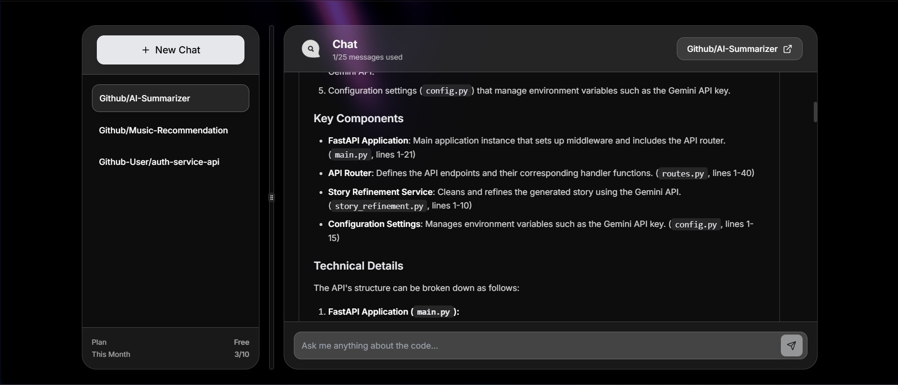

# Qodex


AI-powered code-repository chat system. Add GitHub repositories → ask questions → get intelligent answers about your code.

## 🚀 Live Demo
Visit [qodex-gules.vercel.app](https://qodex-gules.vercel.app) to see the application in action.


## 📝 Project Overview
Qodex is an AI-powered chat system for GitHub repositories. Upload any GitHub repository, and Qodex will analyze the code, create embeddings, and let you have intelligent conversations about the codebase. Ask questions about architecture, understand complex functions, or explore how different parts of the code interact.



## ✨ Key Features

### 🔐 Secure Authentication
- Appwrite Authentication - Email & password authentication
- Google OAuth integration
- Session Management - Secure user sessions and data protection

### 📦 Repository Management
- Add repositories via GitHub URL
- Real-time processing status tracking
- Repository-scoped conversations
- Delete repositories and associated data

### 🤖 AI-Powered Chat
- Intelligent code understanding using embeddings
- Context-aware responses with code citations
- Repository-specific conversation threads
- Source code references in answers

### 🎨 Modern User Interface
- Responsive Design - Works seamlessly on desktop and mobile
- Dark Theme - Modern, eye-friendly interface with glassmorphism
- Real-time Updates - Live message synchronization
- Custom loading states and error handling

## 🛠️ Technology Stack

**Frontend:**
- Next.js 15 - React framework with App Router
- TypeScript - Type-safe development
- Tailwind CSS - Utility-first styling
- Appwrite - Authentication and user management
- Lucide React - Icon library

**Backend:**
- FastAPI - High-performance Python API
- SQLAlchemy - Database ORM
- Neon (PostgreSQL) - Serverless Postgres database
- Pinecone - Vector database for embeddings
- SentenceTransformer - Local embeddings (all-MiniLM-L6-v2)

**Development Tools:**
- ESLint - Code quality
- PostCSS - CSS processing

## 🚦 Getting Started

### Prerequisites
- Node.js (v20 or later)
- npm or yarn
- Appwrite account
- Backend deployment (FastAPI server)

### Installation

Clone the repository:
```bash
git clone https://github.com/Garvit-Nag/qodex.git
cd qodex/qodex-frontend
```

Install dependencies:
```bash
npm install
# or
yarn install
```

Set up environment variables by creating a `.env.local` file:
```env
# Appwrite Configuration
NEXT_PUBLIC_APPWRITE_ENDPOINT=your_appwrite_endpoint
NEXT_PUBLIC_APPWRITE_PROJECT=your_appwrite_project_id

# Backend API
NEXT_PUBLIC_API_URL=your_backend_api_url
NEXT_PUBLIC_API_SECRET=your_backend_secret

# Stripe (for premium features)
NEXT_PUBLIC_STRIPE_PUBLISHABLE_KEY=your_stripe_key
STRIPE_SECRET_KEY=your_stripe_secret
STRIPE_WEBHOOK_SECRET=your_webhook_secret
```

Start the development server:
```bash
npm run dev
# or
yarn dev
```

Open [http://localhost:3000](http://localhost:3000) to see the result.

## 🔐 Authentication Setup

### Appwrite Configuration
1. Create a new project in [Appwrite](https://appwrite.io)
2. Navigate to the project dashboard
3. Copy your project URL and project ID
4. Add these values to your environment variables
5. Enable Google OAuth in Appwrite Authentication settings

### Google OAuth Setup
1. Create a project in [Google Cloud Console](https://console.cloud.google.com)
2. Set up OAuth consent screen
3. Create OAuth client credentials
4. Add Appwrite redirect URI to authorized redirect URIs
5. Add your site URL to authorized JavaScript origins
6. Copy client ID and secret to Appwrite

## 📁 Project Structure

### Frontend
```
qodex-frontend/
├── src/
│   ├── app/                    # Next.js App Router pages
│   │   ├── (auth)/            # Authentication pages
│   │   ├── api/               # API routes (Stripe)
│   │   ├── dashboard/         # Main dashboard
│   │   ├── explore/           # Chat interface
│   │   └── pricing/           # Pricing page
│   │
│   ├── components/            # React components
│   │   ├── auth/             # Auth-related components
│   │   ├── dashboard/        # Dashboard components
│   │   ├── explore/          # Chat UI components
│   │   ├── layout/           # Layout components
│   │   ├── pricing/          # Pricing components
│   │   └── ui/               # Reusable UI components
│   │
│   ├── hooks/                # Custom React hooks
│   ├── lib/                  # Utilities and configs
│   └── types/                # TypeScript types
│
└── public/                    # Static assets
```

### Backend
```
server/
├── app/
│   ├── api/                   # API endpoints
│   │   └── v1/               # Versioned routes
│   │       ├── chat.py       # Chat endpoints
│   │       └── repositories.py # Repository endpoints
│   │
│   ├── core/                 # Core configuration
│   ├── models/               # Database models
│   ├── schemas/              # Pydantic schemas
│   └── services/             # Business logic
│       ├── chat_service.py
│       ├── embedding_service.py
│       ├── github_service.py
│       └── pinecone_service.py
│
├── migrations/               # Database migrations
└── requirements.txt         # Python dependencies
```

## 🚀 Deployment

### Frontend (Vercel)
1. Push your code to GitHub
2. Connect your repository to [Vercel](https://vercel.com)
3. Add environment variables in Vercel dashboard
4. Deploy automatically on every push

### Backend
The FastAPI backend can be deployed on platforms like:
- Render
- Railway
- Google Cloud Run
- AWS Lambda

Make sure to set up the required environment variables for:
- Database connection (Neon)
- Pinecone API credentials
- Embedding service configuration

## 🤝 Contributing
1. Fork the repository
2. Create a feature branch (`git checkout -b feature/amazing-feature`)
3. Commit your changes (`git commit -m 'Add some amazing feature'`)
4. Push to the branch (`git push origin feature/amazing-feature`)
5. Open a Pull Request

## 📄 Credits
Design inspired by [@abhisheksharm-3/inquora](https://github.com/abhisheksharm-3/inquora)

---

Built with ❤️ by Garvit Nag
